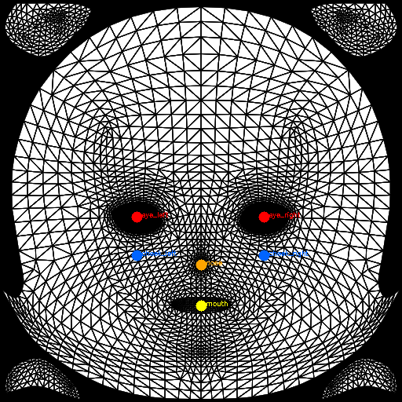
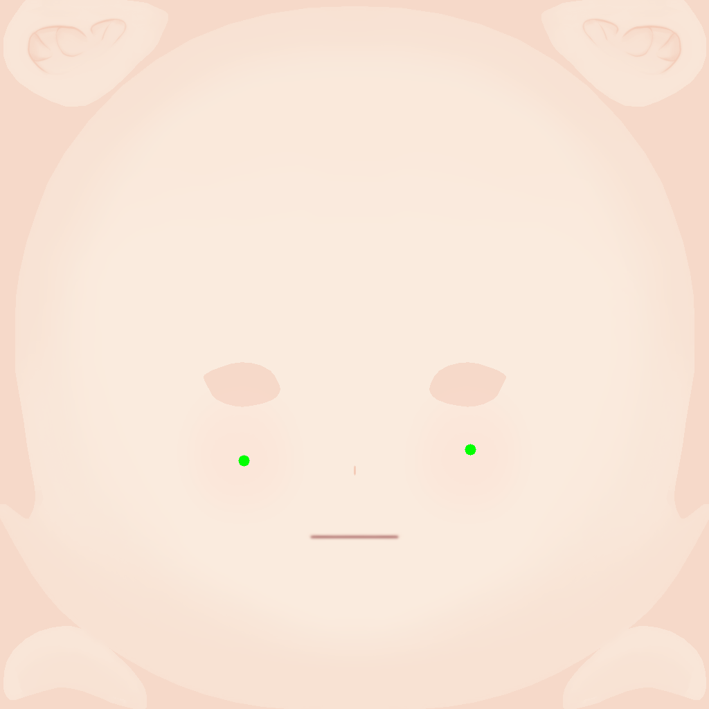
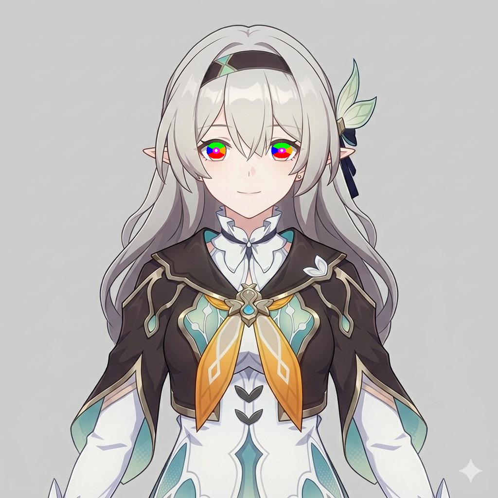
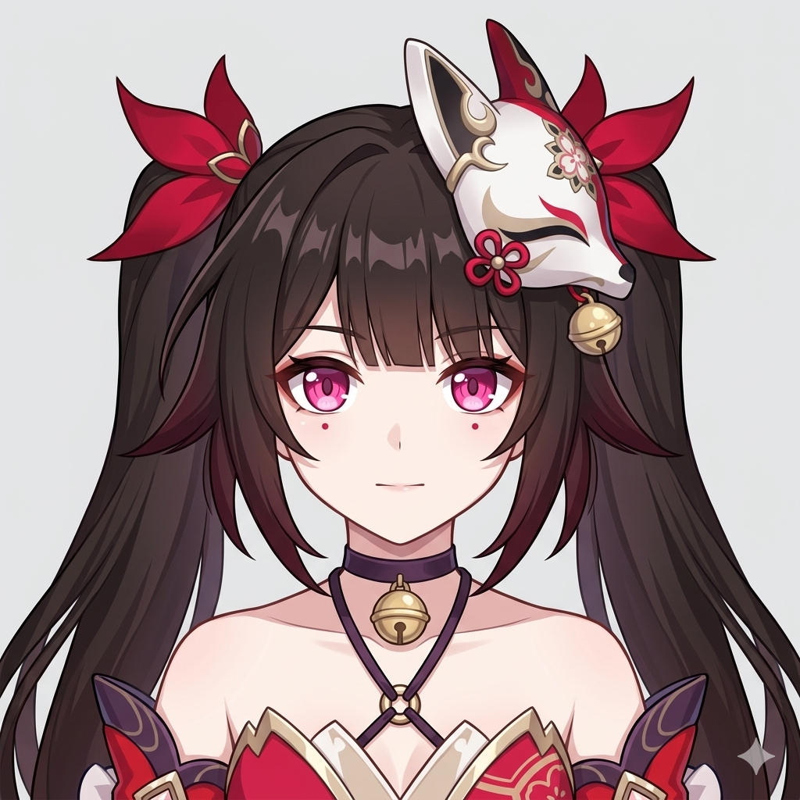
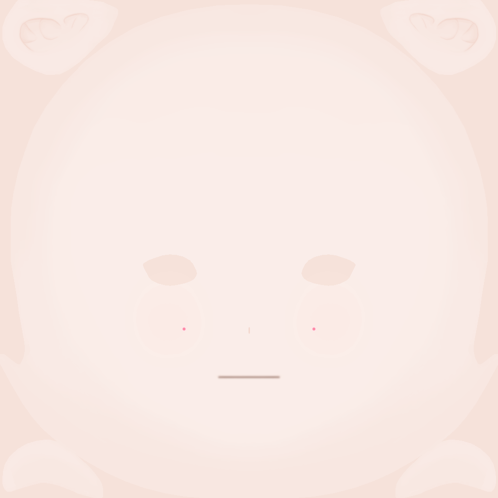
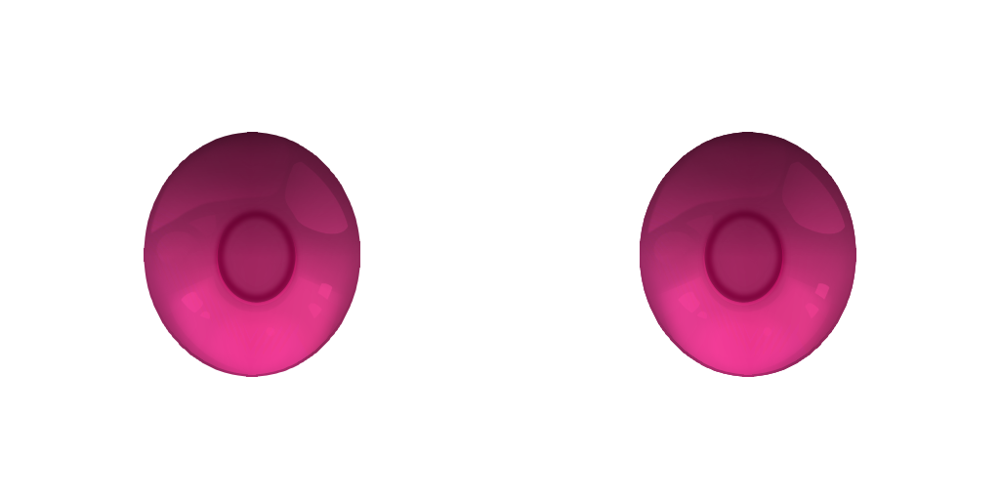
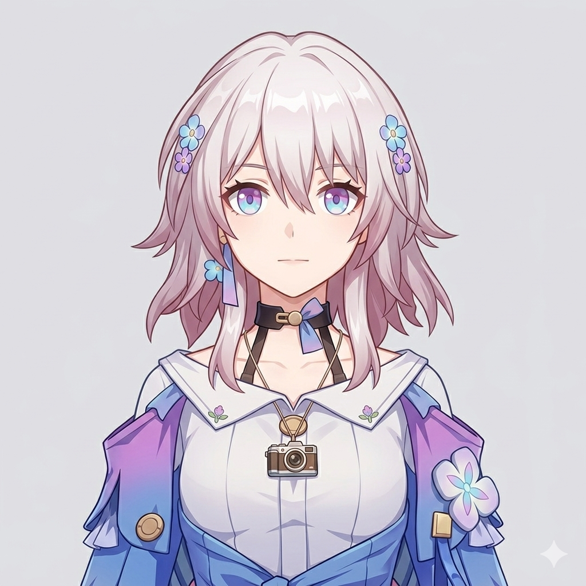
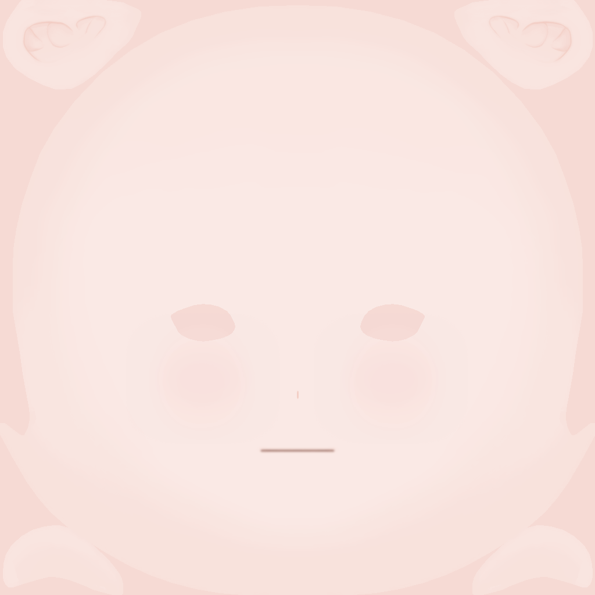
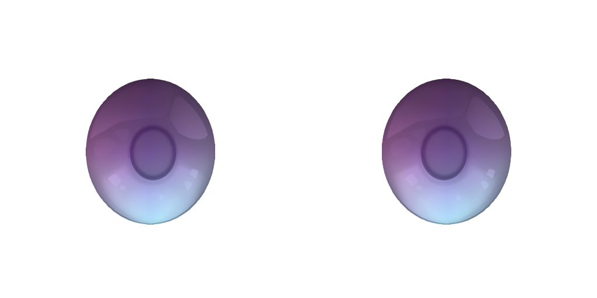

# TexturingPipeline: AI-Powered Anime Character Texture Generation 🎨

[](https://www.python.org/)
[](https://ai.google.dev/)
[](https://opensource.org/licenses/MIT)

**애니메이션 캐릭터 이미지 한 장으로 3D 아바타 텍스처를 자동 보정하는 파이프라인.**

TexturingPipeline은 Gemini API와 OpenCV를 혼용해 캐릭터의 피부톤, 눈동자, 눈썹, 볼터치, 점 등의 특징을 추출하고, 모든 캐릭터가 공유하는 UV 레이아웃 기반의 마스터 텍스처에 자동으로 반영한다.

---

<details>
<summary><strong>목차</strong></summary>

- [🌟 주요 기능](#-주요-기능)
- [🛠️ 작동 방식](#️-작동-방식)
- [💻 시스템 요구사항](#-시스템-요구사항)
- [⚙️ 설치 방법](#️-설치-방법)
- [🚀 실행 방법](#-실행-방법)
- [🔄 텍스처 생성 → 텍스처 수정으로의 전환](#-텍스처-생성--텍스처-수정으로의-전환)
- [📖 제작 과정에서 신경 쓴 부분](#-제작-과정에서-신경-쓴-부분)
- [🖼️ Outputs](#️-outputs)
- [🤔 문제 해결](#-문제-해결)
- [📧 Contact](#-contact)

</details>

---

## 🌟 주요 기능

* 🎨 **피부 표현 보정:**
    * Gemini가 추출한 피부톤을 HSV 색공간에서 보정해 원본 텍스처의 음영과 질감을 유지하면서 색상만 변경
    * 볼터치 유무, 색상, 위치, 불투명도를 UV 고정 좌표 기반으로 자연스럽게 오버레이
    * 점(mole/marking)의 위치를 landmark 기반으로 계산해 텍스처에 드로잉. 좌우 대칭 강제 처리

* 👁️ **눈동자 색상 표현:**
    * 홍채를 상/하/좌/우/중앙 5방향으로 나눠 각 방향의 지배적인 색상을 OpenCV 부채꼴 샘플링으로 추출
    * 각도 기반 smoothstep 보간과 가우시안 블러로 자연스러운 원형 그라데이션 구현
    * 애니 눈동자 디자인 공식을 반영한 상단 어둡기(top_shadow_ratio)와 동공 림(limbal ring) 효과 적용

* 🤖 **Gemini + OpenCV 역할 분리:**
    * 시각적 판단이 필요한 특징(볼터치, 점, 눈썹 등)은 Gemini가 structured output(JSON)으로 추출
    * 정확한 픽셀 값이 필요한 특징(홍채 색상)은 OpenCV가 landmark 기반 좌표에서 직접 샘플링

* ⚡ **배치 처리 및 캐싱:**
    * `input/` 폴더의 모든 이미지를 일괄 처리
    * `features.json` 캐싱으로 불필요한 API 호출 방지
    * Gemini 503 에러 시 자동 재시도 (최대 5회, 15초 간격)

---

## 🛠️ 작동 방식

```
input/캐릭터.png
    ↓
[1단계] kanosawa CFA 모델
    → 애니 얼굴 특화 landmark 24개 추출
    → output/캐릭터명/landmarks.json
    ↓
[2단계] Gemini API (gemini-2.5-flash)
    → 피부톤, 볼터치, 점, 눈썹, 아이라인 등 추출
    → OpenCV로 홍채 5방향 색상 샘플링 (override)
    → output/캐릭터명/features.json
    ↓
[3단계] OpenCV
    → 마스터 텍스처 보정
    → output/캐릭터명/BaseTexture_Generate_*.png
```

---

## 💻 시스템 요구사항

* **Python:** 3.9 이상
* **OS:** macOS, Linux, Windows
* **Gemini API 키:** [Google AI Studio](https://ai.google.dev/)에서 발급
* **패키지:** `requirements.txt` 참고

---

## ⚙️ 설치 방법

**1. 저장소 클론 및 가상환경 설정:**

```bash
git clone <repository_url>
cd TexturingPipeline
python3 -m venv venv
source venv/bin/activate
pip install -r requirements.txt
```

**2. API 키 설정:**

`.env` 파일을 프로젝트 루트에 생성하고 Gemini API 키를 입력:

```
GEMINI_API_KEY=your_api_key_here
```

---

## 🚀 실행 방법

### 기본 실행

```bash
# input/ 폴더의 모든 이미지 일괄 처리
./run_pipeline.sh

# 특정 이미지만 처리
./run_pipeline.sh input/캐릭터.png

# 출력 폴더 지정
./run_pipeline.sh input/캐릭터.png ./my_output

# 다른 Python 환경 지정
PYTHON=/path/to/python3 ./run_pipeline.sh input/캐릭터.png
```

결과는 `output/캐릭터명/` 폴더에 저장된다.

### 출력 파일 구조

```
output/
└── 캐릭터명/
    ├── landmarks.json                    # 얼굴 landmark 좌표
    ├── features.json                     # 추출된 특징값
    ├── BaseTexture_Generate_Face.png     # 피부톤 + 볼터치 + 점
    ├── BaseTexture_Generate_Eyebrow.png  # 눈썹 색상
    ├── BaseTexture_Generate_Eyeline.png  # 아이라인 + 쌍꺼풀
    ├── BaseTexture_Generate_Pupil.png    # 눈동자 색상
    └── BaseTexture_Static_*.png          # 변경 없이 복사
```

> **캐싱:** `features.json`이 이미 존재하면 Gemini 호출을 스킵한다. 재추출이 필요하면 해당 파일을 삭제 후 실행한다.

### 앞뒤 파이프라인 연결

이 파이프라인은 팀 전체 워크플로우의 중간 단계로 설계되었다:

```
[팀원 A] 3D 모델 얼굴 shape 분석 → shape sliders 계산
    ↓
[TexturingPipeline] 캐릭터 이미지 → 텍스처 자동 보정
    ↓
[팀원 B] 보정된 텍스처 + sliders를 마스터 VRM에 적용
```

---

## 🔄 텍스처 생성 → 텍스처 수정으로의 전환

초기에는 Gemini 이미지 생성 기능으로 각 부위 텍스처를 새로 생성하는 방식을 시도했다. 그러나 생성 결과가 일관적이지 않았고, UV 레이아웃에 정확히 맞게 생성하는 것이 어려웠다.

방향 전환의 핵심 근거는 아바타 모델의 구조적 특성에 있다.

* 이 프로젝트의 3D 모델은 **blendshape 기반으로 수정**되며, 새로운 mesh를 생성하지 않는다.
* 따라서 **모든 캐릭터가 동일한 UV 레이아웃을 공유**한다.
* 마스터 텍스처를 기준으로 필요한 부분만 보정하는 방식이 안전하고 예측 가능하다.
* 피부, 눈동자처럼 캐릭터마다 달라지는 부분만 `Generate` 텍스처로 분류하고, 입안처럼 변경이 불필요한 부분은 `Static` 텍스처로 구분해 그대로 유지하는 **선택과 집중**이 가능해졌다.
* 생성이 아닌 보정이므로 원본 텍스처의 음영과 질감이 자연스럽게 보존된다.

### UV 레이아웃 기반 위치 추출

모든 캐릭터가 동일한 UV를 공유하기 때문에, 볼터치·점 등의 위치를 UV 고정 좌표로 정확하게 지정할 수 있다. 아래는 UV 위에 눈/코/입/볼 위치를 매핑한 디버그 이미지다.

| UV 주요 좌표 | 얼굴 위 landmark | UV 위 점 위치 |
| :---: | :---: | :---: |
|  |  |  |

### 홍채 색상 샘플링

홍채를 상/하/좌/우/중앙 5방향 부채꼴 영역으로 나눠 각 방향의 지배적인 색상을 직접 샘플링한다. 안광(흰색 하이라이트) 영역을 자동으로 제외하고 채도가 가장 높은 픽셀을 선택한다.

| 홍채 5방향 샘플링 영역 |
| :---: |
|  |
| 초록=상단, 빨강=하단, 파랑=좌, 주황=우, 마젠타=중앙 |

---

## 📖 제작 과정에서 신경 쓴 부분

### Gemini와 OpenCV의 역할 분리

특징 추출에 두 도구를 병행하되, 각각의 강점에 맞게 역할을 분리했다.

* **Gemini가 담당:** 볼터치 유무/색상/위치, 점의 위치와 색상, 눈썹 형태, 아이라인 스타일 등 — 사람의 시각적 판단이 필요한 특징. Structured output(JSON)으로 출력을 강제해 파싱 안정성을 확보했다.
* **OpenCV가 담당:** 홍채 5방향 색상 — 정확한 위치에서의 정확한 픽셀 값이 필요한 특징. Gemini는 홍채 색상을 단색으로 평균내거나 부정확하게 추출하는 경향이 있어, landmark 기반 좌표에서 부채꼴 영역을 직접 샘플링하는 방식으로 전환했다.

### 눈동자 표현

일반적인 애니메이션 캐릭터 눈동자 디자인의 공식을 분석하여 다음 요소들을 구현했다:

* **5방향 색상 그라데이션:** 홍채를 상/하/좌/우/중앙 부채꼴 영역으로 나눠 각 방향의 지배적인 색상 추출. 각도 기반 smoothstep 보간과 가우시안 블러로 자연스러운 원형 그라데이션 구현
* **상단 어둡기:** 애니 눈동자는 상단이 어두운 것이 특징이며, Gemini가 추출한 `top_shadow_ratio` 값으로 그 정도를 조절
* **동공 림(limbal ring):** 동공 경계 안쪽에 채도를 높이고 밝기를 낮추는 링 효과를 고정 UV 좌표에 적용

### 볼터치 및 점 위치의 좌우 대칭

UV 텍스처가 좌우 대칭 구조이므로, 좌우 쌍의 점은 텍스처에서 동일한 Y좌표에 찍혀야 한다. Landmark에서 좌우 눈 높이가 미묘하게 달라 UV Y가 틀어지는 문제를 `get_reference_point`와 `get_eye_unit`에서 좌우 평균값을 사용하는 방식으로 해결했다.

---

## 🖼️ Outputs

> 이미지 추가 예정

### Sparkle

| 입력 이미지 | Face 텍스처 | Pupil 텍스처 |
| :---: | :---: | :---: |
|  |  |  |

### March 7th

| 입력 이미지 | Face 텍스처 | Pupil 텍스처 |
| :---: | :---: | :---: |
|  |  |  |

---

## 🤔 문제 해결

문제가 발생하면 터미널 로그를 먼저 확인한다.

* **Gemini 503 에러:** 일시적인 서버 과부하. 자동 재시도(최대 5회, 15초 간격)되므로 대기하면 된다.
* **features.json이 업데이트되지 않음:** 캐싱으로 인해 기존 파일을 재사용하는 것. 재추출하려면 해당 파일을 삭제 후 실행한다.
* **점 위치가 어긋남:** Gemini의 `offset_y` 추출이 부정확한 경우. `output/캐릭터명/features.json`에서 `markings` 항목의 `offset_y` 값을 직접 수정 후 `python3 src/adjust_texture.py`만 재실행한다.
* **홍채 색상이 부정확함:** `debug/iris_sector_캐릭터명.png`로 샘플링 영역이 실제 홍채 위에 찍혔는지 확인한다. 안광(흰색 하이라이트)이 샘플링 영역과 겹치는 경우 발생할 수 있다.
* **볼터치가 이상한 위치에 찍힘:** `debug/blush_uv_debug.png`로 UV 좌표가 올바른지 확인한다.

---

## 📧 Contact

UNFLATTEN Team